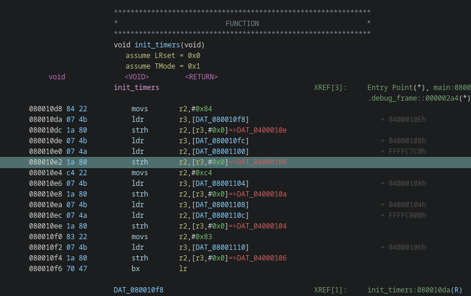
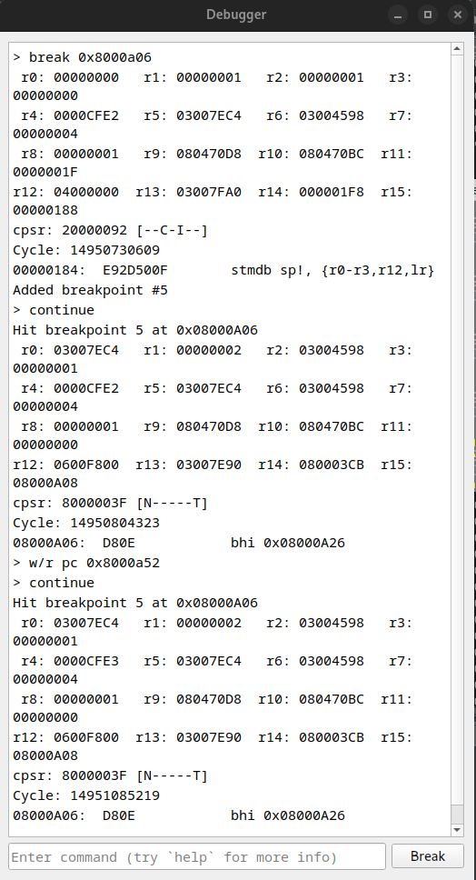

# HF-Advance

## Tools

- Emulator
    - [mGBA](https://mgba.io/downloads.html)
- Reverse Engineering
    - [Ghidra](https://ghidra-sre.org/)
    - [IDA](https://hex-rays.com/ida-pro)

## Getting Started

### mGBA

Loading the game `ROM` in `mGBA` is like every other emulator, simply open the file and the game should play.

`mGBA` has a handful of tools (debuggers, map/item viewers, etc) that are used throughout the writeup.


### Ghidra

Import the `.elf` file in your reverse engineering tool of choice. I prefer Ghidra, but IDA works great aswell. It should be able to auto-detect the architecture and symbols.


## 1 - Locksmith


Let's find a way to move your character to the key.

The character data lives on stack as `main_character` in the `main` function.

```c
int main(void)
{
  uint uVar1;
  int frame_counter;
  char backup_id [13];
  MAIN_CHARACTER main_character; // <--
  
  // ...
}
```

Later in the `main` function, a pointer to `main_character` is passed to a couple functions.

```c
int main(void)
{
   // ...

      animate_main_character(frame_counter,&main_character);
      move_main_character(&main_character);
      interact_item(&main_character);
      check_toggle_switch(&main_character);

   // ...
}
```

Let's use `move_main_character` as it only has one parameter. From `Ghidra`, note the starting address of `0x80004f0` and that register `r0` hold pointer to `main_character`. 


In `mGBA`'s debugger, a breakpoint can be added to reveal the address `0x3007EC4` of the player on stack.

```c
break 0x80004f0
continue
```


This address will remain the same between executions, so keep note of it.

From `Ghidra`, let's view the structure of the `main_character`, which has symbols for the `MAIN_CHARACTER` structure.


`objAttr` doesn't really mean much to us but `x`, `y`, `scroll_x`, and `scroll_y` are interesting. Let's dump their values in `mGBA`'s debugger.

```c
// x
r/4 0x3007EC4+4

// y
r/4 0x3007EC4+8

// scroll_x
r/4 0x3007EC4+12

// scroll_y
r/4 0x3007EC4+16

continue
```


If the `main_character` moves, the data updates. This must be the `main_character`.

Let's update the player's position in `mGBA`'s debugger to key. This can be done in trial and error fashion, but for convenience, these are the "best" values.

```c
// scroll_x
w/4 0x3007EC4+12 150

// scroll_y
w/4 0x3007EC4+16 200

// x
w/4 0x3007EC4+4 100

// y
w/4 0x3007EC4+8 100

continue
```

This will display the flag as a map.


```
HF-vdz88JZZstDvYHqFBXqJM2aatrKheY6R
```

## 2 - Cheater


In `Ghidra`'s `main` function, there is a `process_cheat_codes` function called. This is the target to reach. It is only active when `state` is set to `1`.

```c
int main(void)
{
    // ...
    if ((state._0_1_ & 1) == 0) {
      // ...
    }
    else {
      process_cheat_codes();
    }
    // ...
}
```

In `Ghidra`, double click `state` and the global address `0x3004598` will be revealed.


In `mGBA`'s debugger, we can add a watchpoint to see what code write to this value.

```c
watch/w 0x3004598

continue
```

Pressing the GBA's `start` button (keyboard `Enter`), this will trigger change the state to `1`.


`continue`ing the debugger, the pause screen menu will be displayed.


To prevent the `watchpoint` to trigger over and over, it can be deleted using it's ID (in previous screenshot, it was `2`).

```
delete 2
```

This was all quite useful, but it might be better to control this directly from the debugger. The state can be updated to `1` with the following.

```c
w/1 0x3004598 1
```

*Note: the `pause` map would not appear in this case due to us not triggering the `toggle_pause` code.*

Now that the `process_cheat_codes` can be reached, let's understand what it does.

```c
void process_cheat_codes(void)
{
  int iter;
  u32 hit;

  if (((uint)__key_curr & ~(uint)__key_prev & 0x3f7) != 0) {
    iter = i % 0x10;
    i = i + 1;
    current_cheat[iter] = (uint)__key_curr & ~(uint)__key_prev & 0x3f7;
  }
  iter = 0;
  do {
    if (*(int *)((int)current_cheat + iter) != *(int *)((int)flag2_cheat + iter)) {
      return;
    }
    iter = iter + 4;
  } while (iter != 0x40);
  memcpy16(0x6000000,flag2_map,0xa8c0);
  return;
}
```

The code stores the keys (aka buttons) pressed and compares them to the `flag2_cheat` buffer. By double clicking `flag2_cheat`, the button data is displayed.


Looking online, there are multiple places that has documentation about what the hex values equals ([this site](https://www.coranac.com/tonc/text/keys.htm) is one of the many of them).

```c
#define KEY_A        0x0001
#define KEY_B        0x0002
#define KEY_SELECT   0x0004
#define KEY_START    0x0008
#define KEY_RIGHT    0x0010
#define KEY_LEFT     0x0020
#define KEY_UP       0x0040
#define KEY_DOWN     0x0080
#define KEY_R        0x0100
#define KEY_L        0x0200
```

Using this table, translate the keys from the game data.

```
DOWN
DOWN
A
B
A
B
LEFT
UP
RIGHT
LEFT
UP
RIGHT
L
R
SELECT
SELECT
```

In `Tools > Settings > Keyboard`, check the key mapping to correctly input the buttons.


When ready, reset the game (to make sure the input buffer is cleared) and enter the input in the pause menu. This will confirm that the cheat is correct. 


The flag are the buttons from above.

```
HF-DOWNDOWNABABLEFTUPRIGHTLEFTUPRIGHTLRSELECTSELECT
```

## 3 - Inception


As `Rastislonge` mentions, there is a `.sav` generated. Let's check what type of data this is.

```bash
$ file dax-hf2024-gba.sav

dax-hf2024-gba.sav: Game Boy Advance ROM image: "DEEP" (000000, Rev.00)
```

As the challenge name hints, the game is a gameboy game too! Rename the `.sav` to `.gba` and run the game.


```
HF-5T9VZHFAVVP8HWKZ
```

## 4 - Patience


### Easy

The easiest way to solve the challenge is to just speed up the emulation to maximum speed.


Just let the emulator running in the background and eventually the flag will appear.

### Hard

If you are feeling extra impatient, the start time of the timer can be changed. This is set by writing to a special register `0x4000108` ([find more information here](http://problemkaputt.de/gbatek-gba-timers.htm)). In `Ghidra`, `init_timers` sets this value at `0x80010e2` from register `r2`.



In `mGBA`'s debugger, set a breakpoint at this address.

```c
break 0x80010e2
```

It is important that the value is reset to the original value later in the code. In `timer_isr`, the updated value is used from register `r3` at `0x8001132`.


In `mGBA`'s debugger, set a breakpoint at this address aswell.

```c
break 0x8001132
```

Reset the emulator.

```c
reset
continue
```

Two breakpoints will be hit. For the first, set the value of the timer. This register counts up to `0xFFFFFFFF`, so let's set it to a value nearby.

```
w/r r2 0xFFFFFFFE
```

For the second, override the value of the timer to the original value of `0xC7C0`.

```
w/r r3 0xC7C0
```

It is important these are set these correctly because the flag is generated by XORing these values.


```
HF-LVHRDODMXJBNTJGRISHHVXQJULTIFZLQ
```

*Note: it's quite easy to mistake the U for an O...*


## 5 - Quest


For this one, the intended solution is to satisfy the conditions in `check_toggle_switch`.

```c
void check_toggle_switch(MAIN_CHARACTER *main_character)
{
  // ...

  if (((((byte)story._0_1_ < 0x80) || (main_character->y != 0x48)) ||
      (main_character->scroll_y != 0x138)) ||
     (((0x1f < main_character->scroll_x - 0xf0U || (0x11 < main_character->x - 0x70U)) ||
      (-1 < (int)(((uint)__key_curr & ~(uint)__key_prev) << 0x1f))))) {
    // ...
  }
  else {
    // ...
  }
  return;
}
```

### Lazy (My Solve)

I didn't feel like understanding the conditions, so I just skipped it. This can be done by switching the program counter (`pc`) on the first branch check at `0x8000a06`.


In `mGBA`'s debugger, add a breakpoint at the branch and set `pc` to the code after the condition at `0x8000a52`

```c
break 0x8000a06
continue

w/r pc 0x8000a52

// Clear the breakpoint
delete 1
```



The game will inform us that something happened.


Looking around, find the morse code at the bottom left of the map.


```
.... ..-. -....- --.- .-. .--. .-.. -.- --.. ..-. ... .-.. - .- .... -.... ...- -.. -
```

Putting this value in any morse code converter ([CyberChef](https://gchq.github.io/CyberChef/#recipe=From_Morse_Code('Space','Line%20feed'))), the flag is found.

```
HF-QRPLKZFSLTAH6VDT
```

### Laziest

In `init_map`, add a breakpoint on `bg_pal[50]` being set at `0x8000c88`. The color of the morse code can be set to anything by changing the value of `r2`.

```c
break 0x8000c88
reset
continue

w/r r2 0xFF00
continue
```

Follow the same steps as the `Lazy` solution to decode the morse code. 

## 6 - Groovy


Annoying to do, but quite straight forward. Read the data sent to the sound register and convert the frequencies to notes.

The melody is played by pushing values to the special register `0x4000064` in `play_song` at `0x800104a`. Just check the value of `r3` 32 times to get all the data.

```c
break 0x800104a
reset
continue

continue
// x32
```

This should give the following values.

```
0000872E
0000873A
00008759
0000872E
0000873A
00008759
0000872E
0000873A
00008759
00008721
00008706
00008721
00008706
00008759
0000876C
00008759
00008706
000086B2
000086D7
0000865B
00008673
00008673
00008642
0000860C
00008628
00008628
00008673
000086B2
000086D7
000086E7
000086D7
000086B2
00008673
```

Using [this documentation](http://www.belogic.com/gba/registers.shtml#REG_SOUND1CNT_X), it lets us know the formula to convert the data to frequency is the following.

```
F(hz) = 4194304/(32*(2048-X))
```

A simple Python script can be written to convert the notes.

```python
import math

# From: https://stackoverflow.com/a/70963520
def freq_to_note(freq: float) -> float:
    notes = ['A', 'A#', 'B', 'C', 'C#', 'D', 'D#', 'E', 'F', 'F#', 'G', 'G#']

    note_number = 12 * math.log2(freq / 440) + 49  
    note_number = round(note_number)
        
    note = (note_number - 1 ) % len(notes)
    note = notes[note]
    
    octave = (note_number + 8 ) // len(notes)
    
    return note, octave

# From: http://www.belogic.com/gba/registers.shtml#REG_SOUND1CNT_X
def gba_to_freq(data: int) -> float:
    foff = data & 0b11111111111
    return 4194304 / (32 * (2048-foff))

def main() -> None:
    with open("data") as h:
        lines = h.read().strip().split("\n")

    melody = []
    for line in lines:
        melody.append(int(line, 16))

    flag = []
    for entry in melody:
        freq = gba_to_freq(entry)

        note, octave = freq_to_note(freq)

        flag.append(note)

    print("".join(flag))

if __name__ == "__main__":
    main()
```

This gives the flag.

```
HF-D#EGD#EGD#EGDCDCGAGCGAD#EEDCC#C#EGAA#AGE
```

## 7 - Debug


This one is quite clever. In `main`, there is a special debug section.

```c
int main(void)
{
  // ...

  do {
    // ...

    if ((state._0_1_ & 4) != 0) {
      // <-- HERE
    }
    
    // ...
  } while( true );
}
```

Like for `Cheater`, we can set the value of `state` at `0x3004598`. In this case, we need to set it to `4` to activate the feature.

```
w/1 0x3004598 4
```

If you did like me, you'll have activated the menu somewhere random on the map.


But if you walk at just the right spot...


The flag is visible.

```
HF-8271835581908094
```

*Note: it took me a while to find this...*


## Fin

For being the first to solve the whole track, I got a fun exclusive prize (1/3).


Thanks [@dax](daxAKAhackerman) for the great track!
